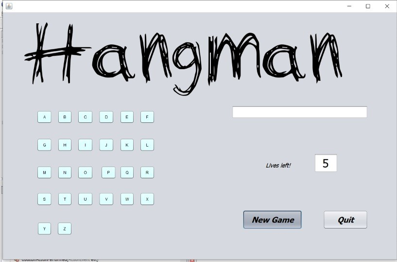
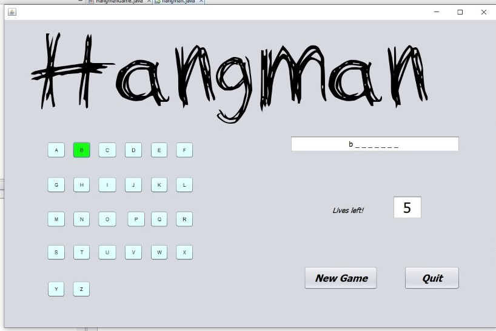
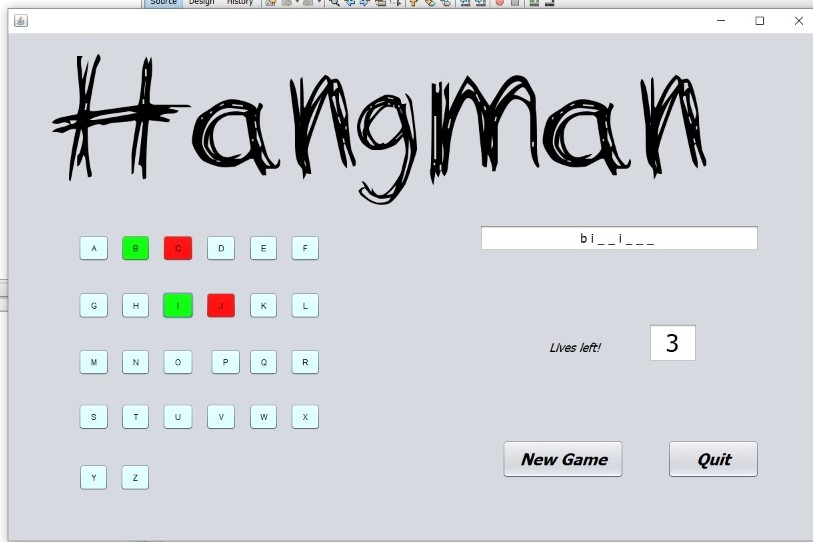
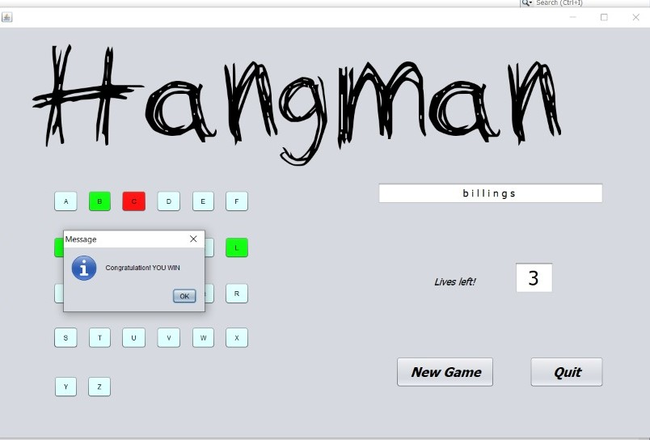
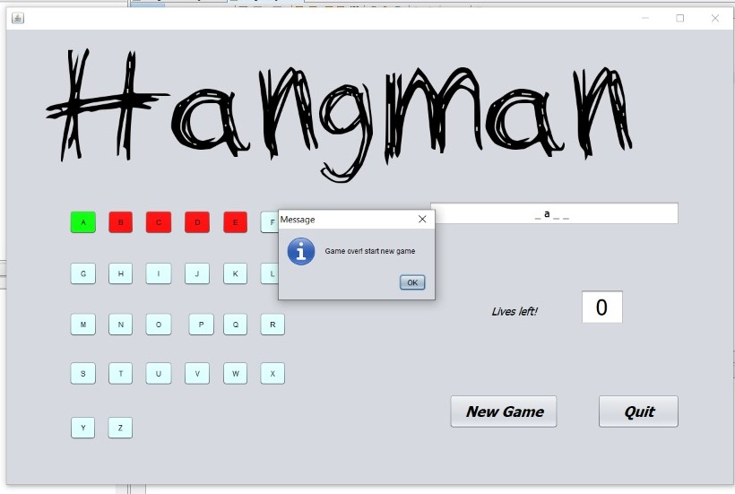
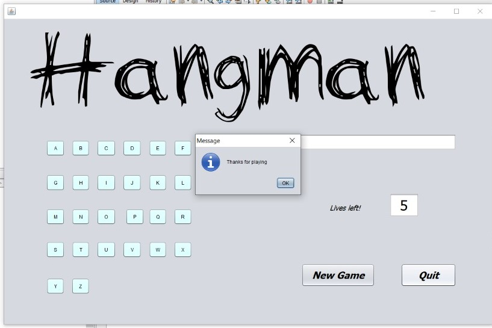

# Hangman Game
## Rules
1. In every Game you have one word to guess.
2. For each character game shows a blank line
3. For every right guess repected blank line shows the character.
4. For every wrong guess you lost one live and after 5 loss game is over and man is Hanged.

    


</center>


# Steps to Run This Project Locally
1. Clone this repo in your machine.
    
   ``` git clone https://github.com/gopalsethlnct/hangman-game ````
    
2. Open folder in your favourite java editor.

3. Compile and Run.
  
4. If you want to modify something, then `open this folder` in your favourite `code editor` and do the changes.


# To play Hangman game
- Dawnload JAR file from the link.
[hangman.jar](https://drive.google.com/file/d/1A1D4vYVxARKK_yISJQrgb_d76Yqov7Z-/view?usp=sharing)
- Double click and play the game.


# Screenshots

<center>






</center>